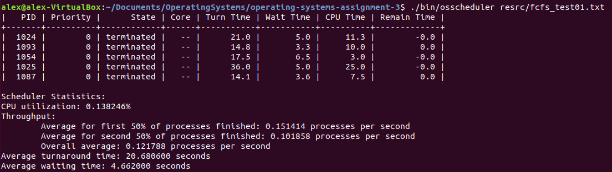

# Process Scheduler
Assignment 3 for Operating Systems class: Processes Scheduling

This project uses C++ to simulate an operating system process scheduler.
The scheduler creates artificial processes to be ran on a artificial CPU.
Multiple processes, that share the same memory, are ran simultaneously on different CPU cores.
The processes are added and removed from the CPU based on the selected scheduling algorithm.
Each process is ran on a different thread and all access the same memory object.
It uses a lock to synchronize the threads to ensure they manipulate the shared data correctly.
After all processes are finished the scheduler prints out statistics for how the processes ran.

## Scheduling Algorithms
Round-Robin - 
Processes that don't finish their execution on the CPU go back into the queue to be executed again.
Test config file: */resrc/rr_test01.txt*.

First Come First Serve - 
Processes are executed until they finish in the order of which they entered the queue.
Test config file: */resrc/fcfs_test01.txt*.

Shortest Job First - 
New processes will replace running ones if they have a shorter execution time.
Test config file: */resrc/sjf_test01.txt*.

Preemptive Priority - 
Processes are executed based on their priority.
Test config file: */resrc/pp_test01.txt*.

## Run on Linux:

Compile using the *make* command.

Run using *./obj/osscheduler resrc/config_file*, where config_file is a configuration file from the resrc folder.

Execution output:

